# Jarkom-Modul-5-B08

Nama | NRP |
--- | --- | 
Adam Hadi Prasetyo | 05111940000224 |
Vyra Fania Adelina | 05111940000109 |
Tsania Az Zahra | 05111940000032 |
___________
## Script
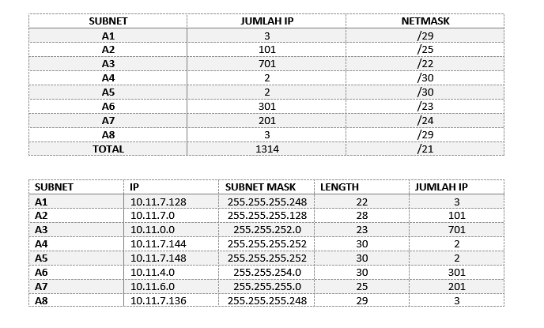
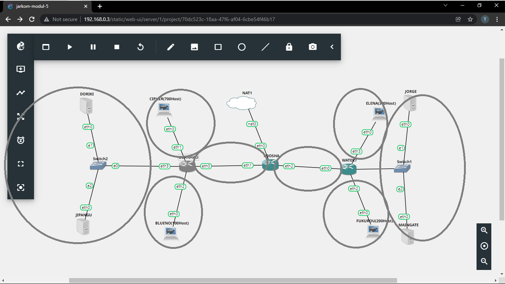
### FOOSHA
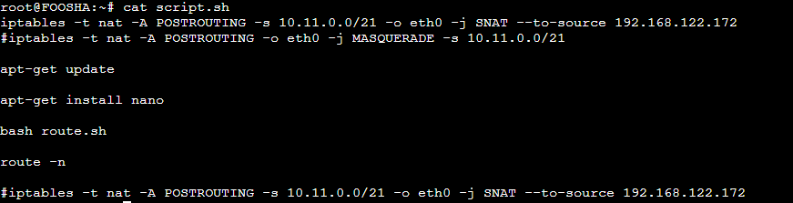
### WATER7
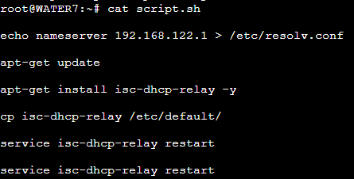
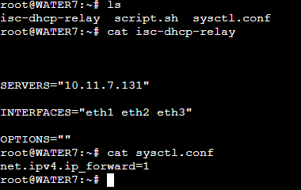
### GUANHAO
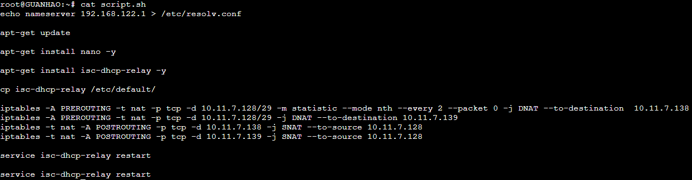
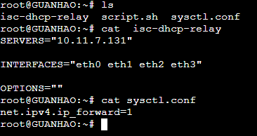
### JIPANGU
### DORIKI
### JORGE
### MAINGATE
### BLUENO
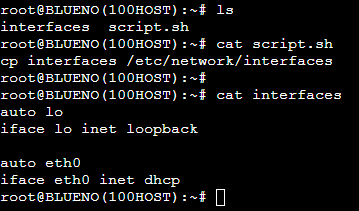
### CIPHER
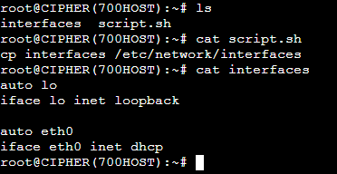
### ELENA
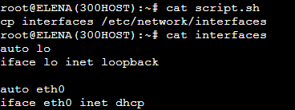
### FUKUROU
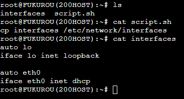
___________
## Soal
1. Agar topologi yang kalian buat dapat mengakses keluar, kalian diminta untuk mengkonfigurasi Foosha menggunakan iptables, tetapi Luffy tidak ingin menggunakan MASQUERADE.
2. Kalian diminta untuk mendrop semua akses HTTP dari luar Topologi kalian pada server yang merupakan DHCP Server dan DNS Server demi menjaga keamanan.
3. Karena kelompok kalian maksimal terdiri dari 3 orang. Luffy meminta kalian untuk membatasi DHCP dan DNS Server hanya boleh menerima maksimal 3 koneksi ICMP secara bersamaan menggunakan iptables, selebihnya didrop.
4. Akses dari subnet Blueno dan Cipher hanya diperbolehkan pada pukul 07.00 - 15.00 pada hari Senin sampai Kamis.
5. Akses dari subnet Elena dan Fukuro hanya diperbolehkan pada pukul 15.01 hingga pukul 06.59 setiap harinya.
6. Karena kita memiliki 2 Web Server, Luffy ingin Guanhao disetting sehingga setiap request dari client yang mengakses DNS Server akan didistribusikan secara bergantian pada Jorge dan Maingate
____
## Jawaban
1. ` Agar topologi yang kalian buat dapat mengakses keluar, kalian diminta untuk mengkonfigurasi Foosha menggunakan iptables, tetapi Luffy tidak ingin menggunakan MASQUERADE.`
   
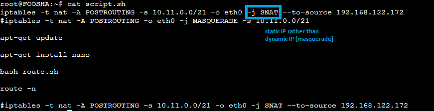

2. `Kalian diminta untuk mendrop semua akses HTTP dari luar Topologi kalian pada server yang merupakan DHCP Server dan DNS Server demi menjaga keamanan.`

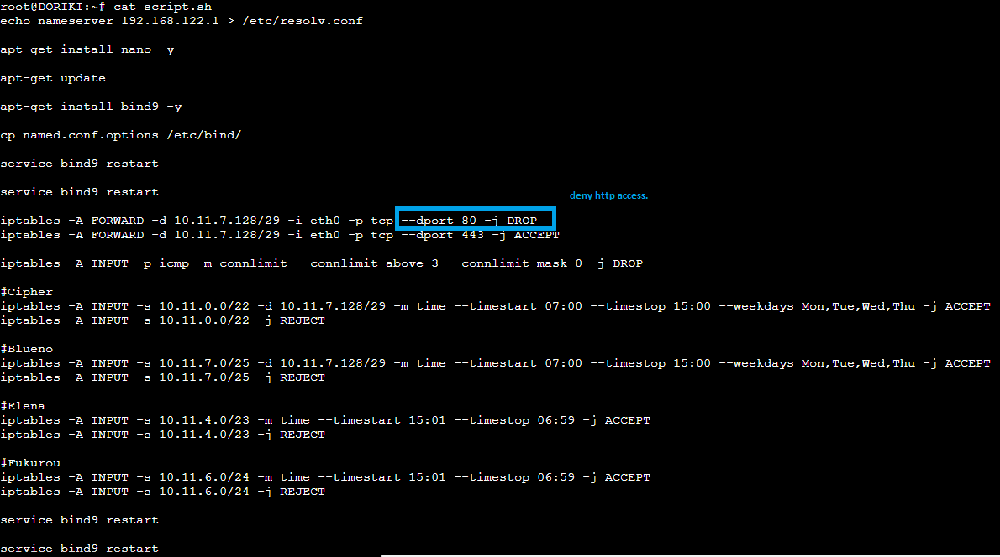

3. `Karena kelompok kalian maksimal terdiri dari 3 orang. Luffy meminta kalian untuk membatasi DHCP dan DNS Server hanya boleh menerima maksimal 3 koneksi ICMP secara bersamaan menggunakan iptables, selebihnya didrop.`

4. `Akses dari subnet Blueno dan Cipher hanya diperbolehkan pada pukul 07.00 - 15.00 pada hari Senin sampai Kamis.`

5. `Akses dari subnet Elena dan Fukuro hanya diperbolehkan pada pukul 15.01 hingga pukul 06.59 setiap harinya.`

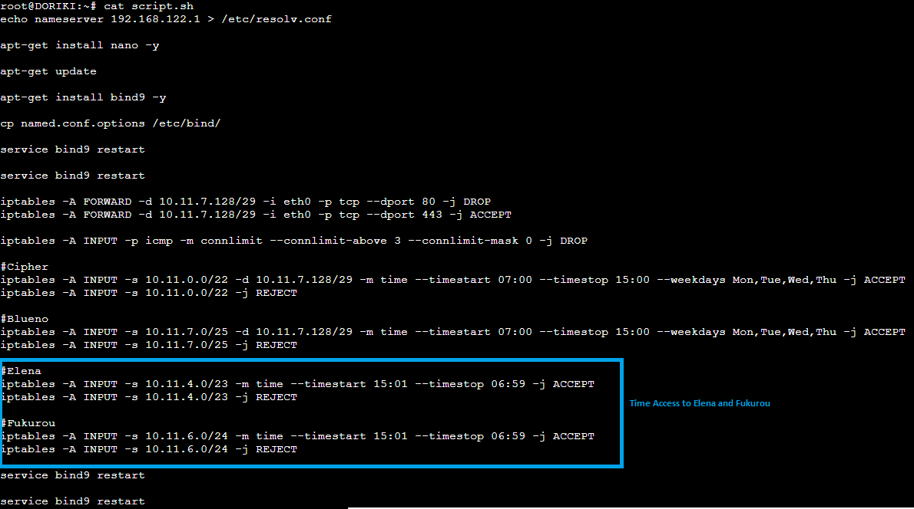

Kendala :
- Testing Belum Bisa Dilakukan Karena Bermasalah Dengan Komputer Host.
